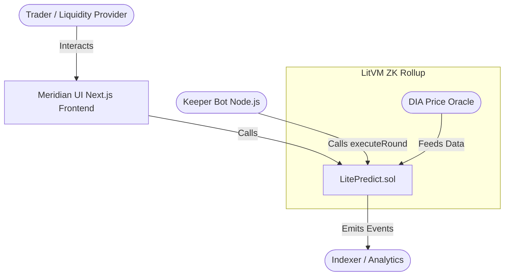

# ⚡ LitePredict-LitVM


> **The Premier Binary Options Protocol on LitVM (Litecoin's ZK Rollup) Powered by DIA Oracles**

LitePredict is a high-performance, decentralized binary options platform natively built for the LitVM ecosystem. By leveraging the speed and low fees of Litecoin's Zero-Knowledge Rollup (LitVM) alongside the robust, tamper-proof data feeds of DIA Oracles, LitePredict offers an unparalleled decentralized trading experience.

---

## 🏗 Project Architecture



---

## ✨ Core Features

*   **Midas-style Landing Page**: A premium, conversion-optimized entry point highlighting protocol TVL, total trades, and live market status.
*   **Meridian UI Overhaul**: A completely redesigned, ultra-smooth trading interface with real-time price charts and intuitive UX.
*   **LitePoints LPs Reward System**: Liquidity providers earn "LitePoints" based on their contribution, gamifying liquidity provision and incentivizing long-term protocol health.
*   **Backtest Engine**: Native tooling to simulate past market conditions and backtest trading strategies directly on the platform.
*   **Live News Categories**: Integrated crypto news feeds directly in the trading terminal, segmented by asset categories (DeFi, L1s, NFTs, etc.).
*   **Paper Trading Mode**: Risk-free environment for new users to test strategies before deploying real capital.
*   **Auto-Network Configurations**: Seamless onboarding with one-click wallet configurations for the LitVM network.

---

## 🚀 Onboarding & Setup Guide

### 1. MetaMask Setup (LitVM Testnet)

To interact with LitePredict, you must configure your wallet for the LitVM Testnet.

> [!TIP]
> Use the "Auto-Connect" feature on our frontend to instantly add the network to your wallet.

**Manual Configuration:**
*   **Network Name:** LitVM Testnet
*   **RPC URL:** `https://liteforge.rpc.caldera.xyz/http`
*   **Chain ID:** `4441`
*   **Currency Symbol:** `zkLTC`

### 2. Faucet

To pay for gas and place trades, you need testnet `zkLTC`.
*   Visit the [LitVM Faucet](https://faucet.caldera.xyz/liteforge) to claim your test tokens.

---

## 🛠 Technical Specification

### Smart Contracts

The protocol's core logic is encapsulated within `LitePredict.sol`, ensuring transparent and immutable round execution.

#### Core Methods:
*   `betBull(uint256 roundId)`: Place a position that the asset price will increase by the end of the round.
*   `betBear(uint256 roundId)`: Place a position that the asset price will decrease by the end of the round.
*   `executeRound()`: Transitions the current round, fetching the latest price from the DIA Oracle and determining the winning side.
*   `claim(uint256[] roundIds)`: Claim winnings from successful predictions.

#### DIA Oracle Integration
LitePredict relies on [DIA Oracles](https://diadata.org/) for highly reliable, cross-chain price feeds. The oracle address is hardcoded and verified in the contract deployment scripts.

#### Testing
The smart contract suite is rigorously tested using Foundry.
```bash
# Run the test suite
forge test -vvv
```

---

## 🤖 Keeper Bot Setup

The automated market lifecycle is maintained by a decentralized keeper bot located in the `/keeper` directory. This Node.js/TypeScript service is responsible for calling `executeRound` precisely every 5 minutes.

> [!WARNING]
> The keeper bot requires an externally owned account (EOA) funded with `zkLTC` to cover gas fees for executing rounds.

**Running the Keeper:**
```bash
cd keeper
npm install
npm run build
# Set your PRIVATE_KEY in a .env file first
npm run start
```

---

## 💻 Development & Installation

Follow these steps to run the frontend and development environment locally.

```bash
# Clone the repository
git clone https://github.com/83mhpll/LitePredict-LitVM.git
cd LitePredict-LitVM/frontend

# Install dependencies
npm install

# Start the development server
npm run dev
```
Navigate to `http://localhost:3000` to view the application.

---

## 📝 Semantic Commits Guideline

To maintain a clean and readable Git history, we strictly follow the [Conventional Commits](https://www.conventionalcommits.org/) specification.

| Prefix | Description | Example |
| :--- | :--- | :--- |
| `feat:` | A new feature | `feat: integrate DIA oracle feed` |
| `fix:` | A bug fix | `fix: resolve claim calculation error` |
| `design:` | UI/UX visual changes | `design: update Meridian button styles` |
| `docs:` | Documentation only changes | `docs: add keeper setup guide` |
| `refactor:` | Code change that neither fixes a bug nor adds a feature | `refactor: optimize executeRound gas usage` |
